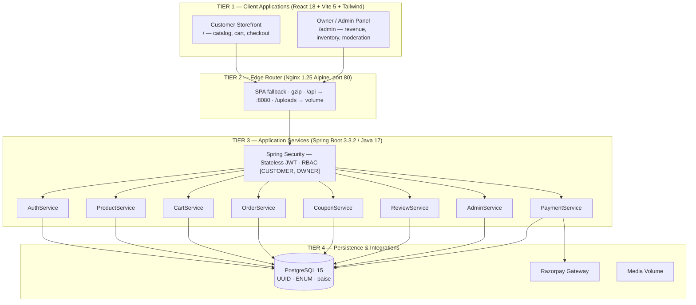
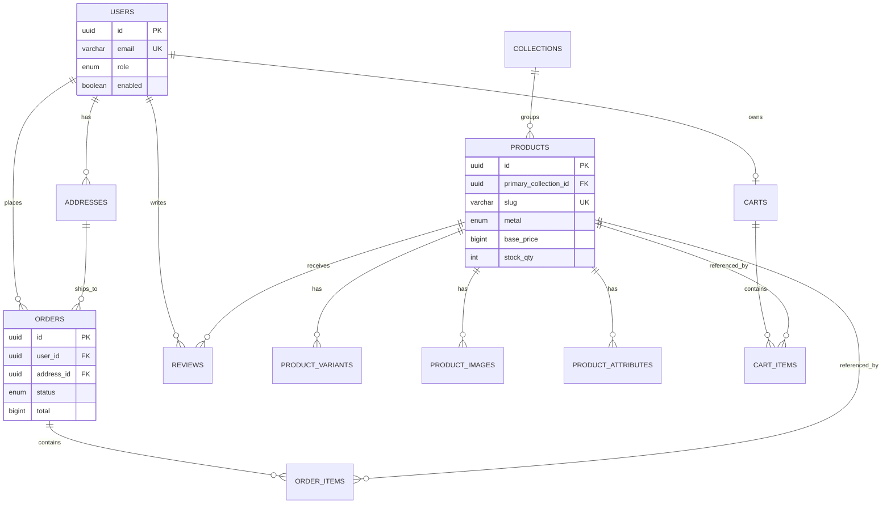

<div align="center">

# ✦ Aurora Gems ✦
### Full-Stack Luxury Jewelry Commerce Platform

*Customer storefront · Owner admin console · Spring Boot 3 REST backend · PostgreSQL 15*

`Spring Boot 3.3.2` · `Java 17` · `React 18` · `Vite 5` · `PostgreSQL 15` · `Docker Compose` · `Nginx`

</div>

---

## Overview

Aurora Gems is an enterprise-grade jewelry commerce platform with a customer-facing storefront, a
dedicated owner/admin operations panel, and a Spring Boot 3 REST backend on PostgreSQL. Pricing,
stock, and order state are always authoritative on the server — the client is never trusted with
totals.

## Architecture



## Database Schema



> Full column-level schema: [`schema.sql`](./schema.sql) · Full ERD: [`schema.drawio`](./schema.drawio) / [`schema.png`](./schema.png)
> Complete architecture write-up: [`Aurora Gems - Architecture Specification.pdf`](./Aurora%20Gems%20-%20Architecture%20Specification.pdf)

## Tech Stack

| Layer | Technology |
|---|---|
| Frontend | React 18, Vite 5, React Router v6, Axios, Tailwind CSS, Framer Motion, React Hook Form, Zod |
| Backend | Java 17, Spring Boot 3.3.2, Spring Security (JWT), Spring Data JPA, Hibernate 6, HikariCP |
| Database | PostgreSQL 15 — UUID keys via `pgcrypto`, native ENUM types, integer-paise currency |
| Infra | Docker multi-stage builds, Docker Compose, Nginx reverse proxy |

## Quick Start

```bash
docker compose up --build -d
```

| Surface | URL |
|---|---|
| Customer Storefront | http://localhost |
| Owner / Admin Panel | http://localhost/admin |
| Backend API | http://localhost:8080/api/v1 |
| Health Probe | http://localhost:8080/actuator/health |

<details>
<summary><b>Local development (without Docker)</b></summary>

```bash
# 1. Database
docker compose up -d postgres

# 2. Backend
cd backend && mvn clean package -DskipTests && mvn spring-boot:run

# 3. Frontend
cd frontend && npm install
npm run dev          # Customer storefront — :5173
npm run admin:dev    # Owner panel        — :5174
```

</details>

## Default Credentials

| Portal | Email | Password | Role |
|---|---|---|---|
| Customer Storefront | `aarohi@example.com` | `Password@123` | `CUSTOMER` |
| Owner / Admin Panel | `maniyadaxit1234@gmail.com` | `Daxit@2001` | `OWNER` |

## Key API Endpoints

<details>
<summary>Expand endpoint reference</summary>

**Auth**
- `POST /api/v1/auth/register` · `POST /api/v1/auth/login` · `POST /api/v1/auth/owner/login`
- `POST /api/v1/auth/refresh-token` · `POST /api/v1/auth/logout`

**Catalog**
- `GET /api/v1/products` · `GET /api/v1/products/{slug}`
- `GET /api/v1/collections` · `GET /api/v1/collections/{handle}/products`

**Cart & Orders**
- `GET|POST /api/v1/cart` / `/cart/items` · `POST /api/v1/coupons/validate`
- `POST /api/v1/orders` · `GET /api/v1/orders` · `GET /api/v1/orders/{id}`

**Owner**
- `GET /api/v1/owner/dashboard` · `GET /api/v1/owner/orders` · `PATCH /api/v1/owner/orders/{id}/status`
- `GET /api/v1/owner/users` · `GET /api/v1/owner/reviews` · `PATCH /api/v1/owner/products/{id}/inventory`

</details>

## Security & Design Principles

1. **Backend-enforced totals** — prices and discounts are always recomputed server-side.
2. **Atomic inventory decrement** — stock is verified and deducted inside one `@Transactional` boundary.
3. **Sanitized error responses** — no leaked SQL, stack traces, or internal paths in production.
4. **Non-root containers** — the backend image runs as an unprivileged `appuser`.
5. **Batch query optimization** — review stats resolve in a single query, eliminating N+1 round-trips.

## Testing

```bash
cd backend && mvn test
```

Covers `AuthServiceTest`, `OrderServiceTest`, `CouponServiceTest`, and `ProductServiceTest`
(registration, JWT lifecycle, cart pricing, coupon rules, stock decrement, order transitions).

---

<div align="center">
<sub>Aurora Gems — built by Daxit Maniya, IIIT Vadodara</sub>
</div>
